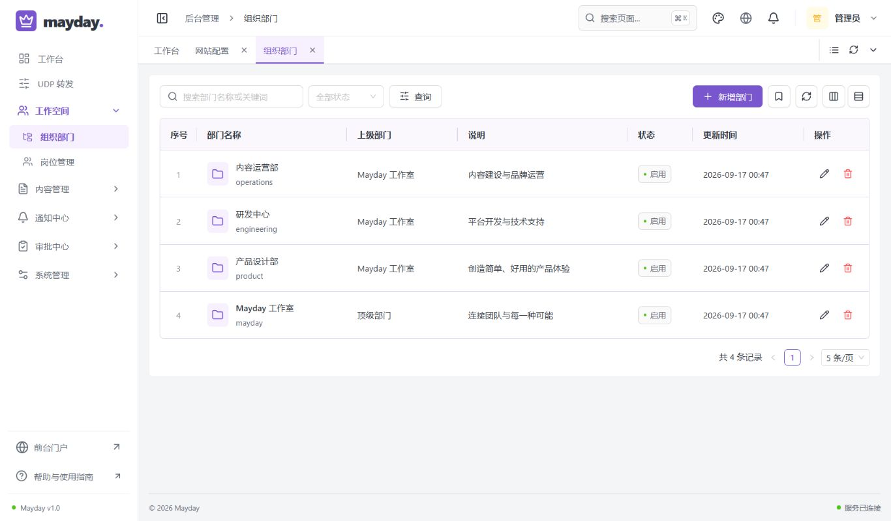
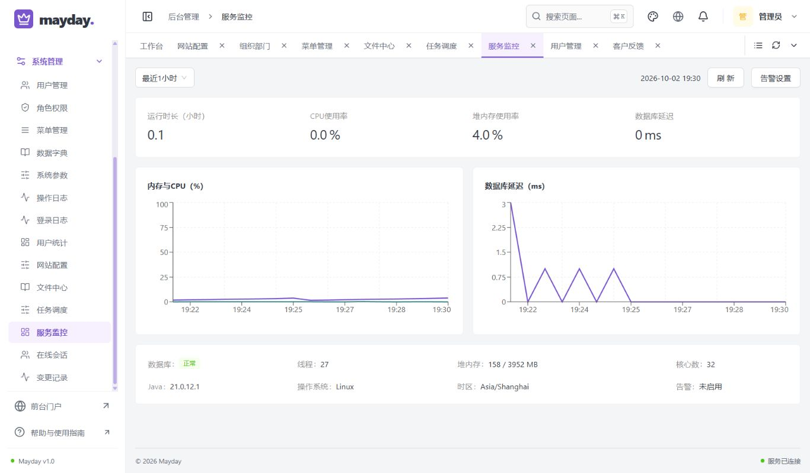
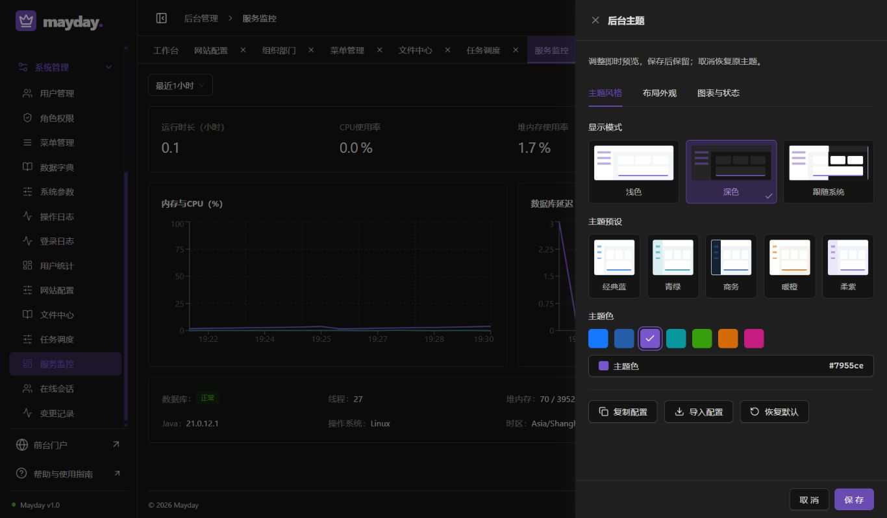
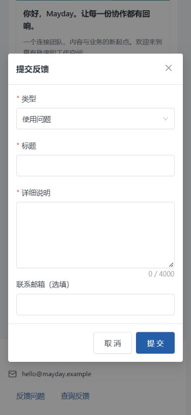

# 通用能力、全量源码规范与表格细节验收

验收日期：2026-10-02。范围为本轮已授权的通用平台能力、新旧源码规范和表格底部重复边线修正。参考产品用于研究交互和功能，不引入行业演示、AI 助手或第三方商业代码；UDP 转发不扩展、不重新进行速率验收。

## 实际交付

- 文件中心采用统一存储接口，新增 LOCAL 持久目录和 S3 兼容适配，保留历史 MySQL 文件；支持目录、鉴权缩略图、批量移动、回收、恢复和异步清理。被内容版本、通知、审批或采集使用的文件不能回收或永久清理。
- 实时提醒采用用户隔离 SSE、心跳、重连和轮询兜底；通知正文继续通过鉴权接口读取。审批支持催办、节点超时提醒和复制常用流程模板。
- 共用表格增加列宽调整、列排序偏好、当前页 CSV/打印、移动端卡片；用户 CSV 导入包含模板、预检、错误文件和原子提交，异步导出重新核对权限与数据范围，仅作业所有者下载。
- 调度只调用代码注册的处理器；失败执行独立保存，提醒去重与失败重试。监控保留真实采样、CPU/内存与数据库趋势，以及独立权限控制的阈值提醒。
- 门户支持提交反馈和凭查询码跟踪；后台支持分配、公开回复、内部备注和处理历史。匿名接口不返回内部记录、联系信息或处理人。
- 账号、角色授权、内容发布等已接入可读的前后差异审计，失败事务不留下成功变更记录。未接入的业务不会被宣称已经审计。
- 手写前后端旧代码和新增代码统一职责与业务边界注释、显式导入、命名及格式检查；生成器同步约定，规范检查进入工程验证与 CI。
- 修复通用表格重复底线：外框作为底部唯一边界，最后一条可见记录不再叠加单元格底线；涵盖普通、树形、隐藏展开行、空表格、弹窗和固定列。

能力配置、权限和扩展方式详见 [通用能力说明](../general-platform.md)、[批量数据说明](../bulk-data.md)、[二次开发说明](../reuse.md)。

## 自动检查

最终工程检查日志为 `.local/general-project-final.log`：

- Java AST 检查覆盖 214 个手写源码文件，前端 AST 检查覆盖 108 个手写文件，无待处理项。检查包含公开业务说明、显式导入和前端禁止宽泛 `any`；生成类型由契约生成，人工说明不写入生成文件。
- 32 项模型/生成器检查、44 项 React 交互及边界检查全部通过，没有失败或跳过。新增反馈导航检查确认授权入口可见、未授权入口不会凭前端登记生成、分组名称整行展开/折叠以及缩窄侧栏访问。
- 前后端格式、135 个真实接口路径的 OpenAPI/TypeScript 契约、前端类型和生产构建通过。
- 最新 Docker 后端构建包含 91 项声明测试，76 项执行通过、15 项按环境条件跳过：旧采集真实数据库测试 11 项、S3 条件测试 1 项，以及 Docker 默认 UDP 缓冲不满足条件的 3 项。不将跳过计为通过；本轮不重新验收 UDP 速率。
- S3 条件测试另外接入真实临时 S3 兼容服务，1 项执行通过、无跳过，验证写入、读取、存在查询、删除、幂等删除和缺失对象 404。使用固定摘要的社区源码构建 MinIO 镜像 `ghcr.io/coollabsio/minio`，不是官方镜像；服务只绑定本机，完成后容器、临时卷与凭证已清理。本次结果不替代生产对象存储的运维验证。

测试还覆盖 CSV 引号/空行/密码空白边界、导入授权与全部回滚、导出越权/撤权、文件路径与目录边界、提醒去重、调度失败回滚记录、监控采样与提醒事务隔离。完整日志和临时备份保留在忽略目录 `.local`，不提交测试账号、凭证、业务备份或会话。

## 数据库与真实接口

隔离验收编号 `20261002111047928-de6705`，结果 `.local/baseline/20261002111047928-de6705/result.json` 为 passed：

- 将日常库完整备份恢复到独立升级库，再与纯净新建库和唯一 SQL 安装库核对。
- 升级库、纯净新建库各 129 项真实 MySQL HTTP 检查全部通过，无失败、无跳过；覆盖原功能及文件、批量、实时审批和本轮通用能力。
- 两种模块裁剪组合、实际控制器契约、测试记录清理及重启检查通过。已有账号、角色授权、组织、内容及采集记录未因验收而改变。
- 排除 Flyway 管理表后三库各 48 张业务表、471 个字段，中文表/字段注释一致。索引与外键另用正式语义检查函数核对，各 121 个索引、45 个外键；列顺序、唯一性、前缀、可见性、引用关系和更新/删除规则一致。证据 `.local/general-constraints.json`。
- 本轮新增 V19，原 V1–V18 文件和校验和未改。唯一交付 SQL 仍为 `database/mayday.sql`；V19 已安装后不可修改，下一变更采用 V20。
- V19 对通知正文字段由 TEXT 扩为 LONGTEXT，属于明确的结构扩展；原记录保持一致。其他原字段定义核对通过。

索引/外键比较已接入今后的基线检查。此次完整验收运行时加载的是原脚本，因此结构约束由同一次保留的三个数据库单独执行新增函数核对，没有把未执行的检查伪称已经包含在原日志里。

独立验收容器、网络和数据卷已清理；日常 `mayday` 项目继续运行，备份保留。

## 本机升级与浏览器实测

升级编号 `20261002112132111`：停写后保存完整数据库备份和原前后端镜像，再迁移到已通过验收的 V19，原业务与授权核对通过。升级后又部署仅含侧栏反馈入口和监控指标排列修正的前端构建；后端和数据库不重复迁移。

内置浏览器使用已有后台会话实测；未再次处理滑块或修改账号权限。桌面 1366×800、1280×720 和手机 375×812：

- 组织部门、文件中心和菜单树表的最后可见行单元格底线为 0，表格仅保留外框。菜单末组展开及折叠均检查；文件目录弹窗的空表格和客户反馈空表格同样只有一条底线。
- 文件中心原有五个缩略图正常加载。两种桌面尺寸无默认横向滚动条和页面纵向滚动；手机切换为每页一条可勾选卡片，保留预览、下载、更多操作和分页，无页面横向溢出。
- 客户服务整组展开后可进入反馈页；用户管理、角色权限仍在系统管理，菜单未改成双侧导航。
- 用户导入弹窗可打开，未选择文件时预检及确认导入禁用；模板入口和错误说明齐全，取消可退出。实际导入、导出业务结果由上述真实 API 和组件检查验证，不在日常库写入演示用户。
- 调度新增配置弹窗正常加载代码注册的处理器与独立提醒接收人；未擅自创建日常自动执行任务。
- 监控四个指标横向排列，真实历史图表和告警设置弹窗正常。1366×800 首屏文档尺寸与视口一致，没有因指标堆叠产生纵向滚动。
- 后台主题仍使用右侧抽屉，深色即时预览有效，取消恢复原浅色主题，没有覆盖前台配置。
- 门户反馈提交和查询均为弹窗，手机表单完整可用；375px 窗口文档宽度为 375px，前台不存在 `/admin` 入口。浏览器检查未提交真实客户反馈。
- 后台本轮页面控制台 error/warn 为空。临时视口设置已恢复，额外验收门户页签已关闭。

## 使用边界

当前 SSE 事件总线、公共反馈来源限流按单实例实现，多实例部署需要共享总线及限流存储；消息数据库与轮询兜底保持可靠读取。数据库完全离线无法向同库写入告警，需要外部监控。任务事务超时不能强制中断任意 CPU/外部操作；业务处理器仍须幂等，长任务需要独立队列。对象存储凭证、容量、备份及部署基础设施须按实际环境配置。以上边界已写入复用说明，不承诺不经业务验收即可用于任意生产系统。
