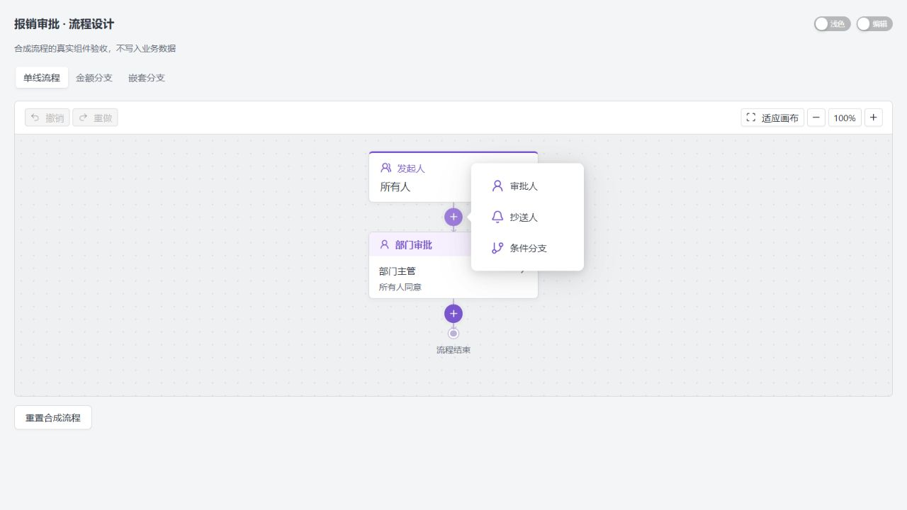
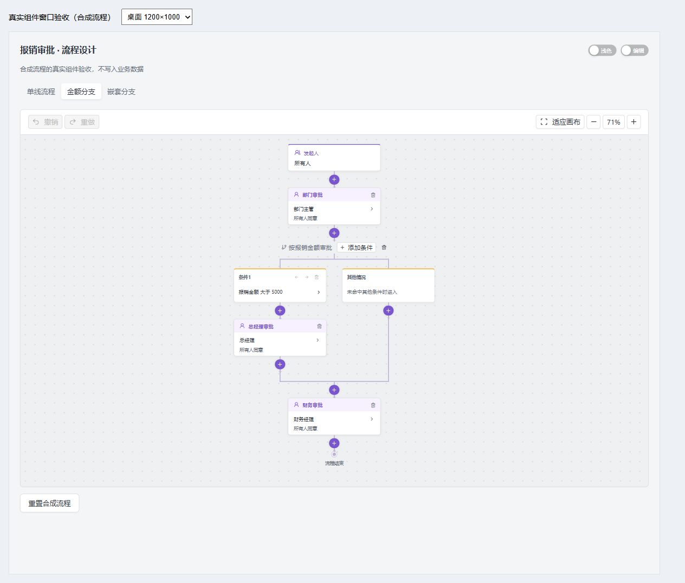
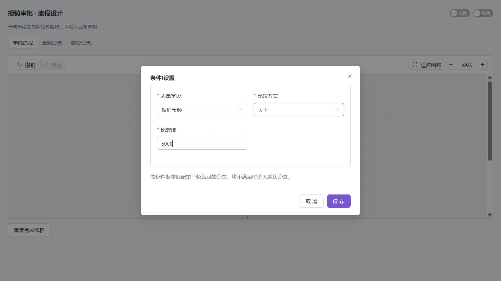
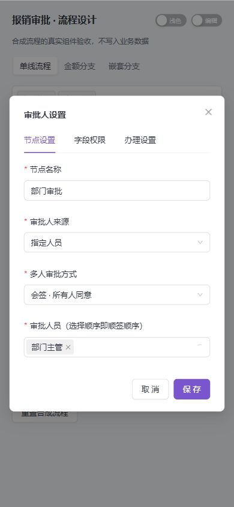
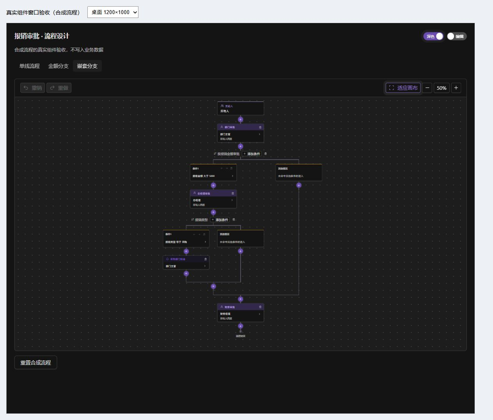

# OA 流程设计器交互验收（2026-10-03）

用户反馈原设计器无法正常使用：顶部添加生成孤立节点，节点靠“后接节点”和手动选择出口维护，删除后留下断开的引用。本批替换日常编辑交互，不更换运行引擎，不改数据库和旧发布快照。

## 已实现的操作

- 纵向发起人／审批／抄送／结束，在线路加号选择类型，定点插入并自动接续。
- 横向条件与默认路线、单个条件弹窗、优先级前后调整、规则增删；分支内部插入与汇合后共同插入明确区分，支持嵌套。
- 节点设置只编辑人员、模式、字段授权和办理动作；隐藏技术 ID、类型和手动出口，保存不丢其他配置。
- 删除普通节点自动回接全部入线；条件组删除保留默认路线、公共后续和无关旧节点；仅清理被删除分支独有节点。正在引用的结束节点受保护，孤立结束节点可以明确删除。
- 撤销／重做最近 30 次本地修改、缩放和适应画布；键盘打开加号进入选项，Escape 返回原线路。
- 只读账号禁用修改入口；损坏旧草稿明确提示并提供专用修复。结束节点历史 `next` 与后端一样不参与执行；只有各路径必经的节点才画成汇合。
- 交叉旧 DAG 设置展开预算，避免指数级页面渲染。可达性独立计算，折叠不会误报孤立节点；原图可用完整连线弹窗查看，显示过程不改变模型。

参考 [飞书官方审批流程设计说明](https://www.feishu.cn/hc/zh-CN/articles/360036163653-%E7%AE%A1%E7%90%86%E5%91%98%E8%AE%BE%E8%AE%A1%E5%AE%A1%E6%89%B9%E6%B5%81%E7%A8%8B) 的节点间添加和条件分支交互。条件仍是本引擎支持的依次首匹配，不把横向分支称为并行会签网关，不展示不可执行的节点类型。

## 自动化与真实后端

- 图操作 19 项、节点业务表单 3 项、真实 Ant 画布交互 12 项通过，包括条件／默认／共同后续区分、确认取消、独立结束、只读、键盘和 729 路径组合的旧图有界展开。
- 全量工程检查：214 个 Java、115 个手写前端源码规范，格式、138 个接口路径契约、32 项模型／生成器、82 项前端交互与图操作、类型及生产构建通过。真实接口用例默认需隔离环境，单列 1 项跳过，不计通过。
- 保留的独立 Java 环境 `mayday-check-20261002141131006-1ab6c2`、端口 18085：新增设计器 API 验收 **8/8 通过**，17 条成功执行路径、2 次预期 400 拒绝。将实际图编辑函数生成的模型交给同一发布级校验与路径模拟，覆盖嵌套、共享后续、删除、优先级和人员／条件未配置。
- 本次只登录和模拟，没有创建、发布流程或业务申请，没有修改账号或权限。模拟前后流程定义、审批申请数量一致；日志及凭证仅在忽略目录 `.local`，不传入浏览器。
- 后端源码、数据库、唯一安装 SQL 及 Flyway 版本均未改动。本次不重复宣称执行了上轮 135 项全库验收；其记录保留在 [OA 执行闭环验收](../oa-validation-20261002/README.md)。

新增回归文件为 `frontend/tests/workflow-graph.test.ts`、`workflow-canvas.test.tsx`、`node-editor-structured.test.tsx`、`workflow-designer-api.test.ts`。前三类由 `scripts/check-project.mjs` 自动发现。真实 API 测试使用 `API_BASE=http://127.0.0.1:18085/api`、独立项目标识与进程环境凭证，在 frontend 目录由 Node 的 tsx 加载；缺少独立环境时跳过，禁止日常 18080。

## 浏览器检查

截图为真实生产组件和明确标识的合成流程，不是伪造登录的后台页面，不替代完整业务办理验收。

- 原生 1280×720：单线流程在 100% 下页面 1280×720、画布可用高／滚动高 370／370，无默认横纵溢出；线路加号、选类型、单条件设置并保存已实际操作。
- 桌面独立页面窗口 1200×1000：金额分支与嵌套分支使用适应画布，窗口滚动尺寸 1200×1000，画布可用高／滚动高 650／650；普通与深色主题均检查了真实连线与公共后续。
- 手机独立页面窗口 390×844：单线流程 100% 时窗口滚动尺寸 390×844、画布宽／滚动宽 349／349、高／滚动高 434／434。审批设置弹窗宽 358、内容宽 310、高／滚动高 409／409，无默认横纵溢出；窄工具栏分行，不卡掉缩放按钮。
- 实测条件内添加抄送后取消配置：新节点仍属本地草稿，撤销才移除插入。保存条件只改变所选规则，不改变其出口；所有未配置内容仍由后端发布校验阻止。
- 浏览器视口覆写接口在本次未改变原生页面尺寸，尺寸检查改用独立真实 iframe 浏览上下文，按其实际 DOM 尺寸记录。没有修改业务页 CSS 来伪造窗口大小。复杂流程允许正常画布滚动，适应画布为浏览选项，不永久缩小表单或裁切内容。

## 部署与边界

本机仅重建并更新前端，镜像 `7cc99b78a750fa2a4093e36ff0ecb1832b9d96a44997ac5c45dcdfd99d9b9b3e`；门户、设计器路由和登录页均返回 200，新设计器脚本及样式与本轮构建 SHA-256 一致，后端和 MySQL 原容器继续运行。见 [部署核对](deployment.json)。

日常后台会话已过期，登录后的整页设计／保存／发布验收仍需本次滑块授权；已在页面会话检查后另行请求，浏览器操作规则要求每次处理验证码时单独确认，没有绕过验证码或注入 API 会话。上轮完整浏览器发起／退回／重提也仍保留待验收，不标记本项目 OA 全部验收完成。

本批解决节点添加和编排交互。并行汇合网关、子流程、AND/OR 条件组、表单公式、代理交接等原有能力边界未改变。发起人和连线汇合只用于编辑展示，不新增虚构执行节点；已发布版本和在途申请快照保持原样。
