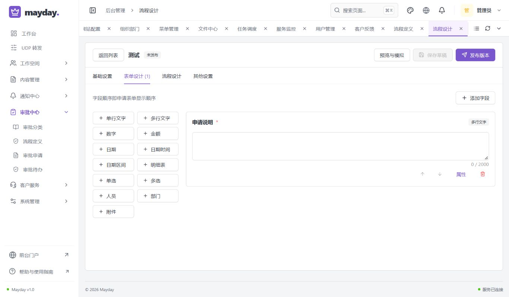
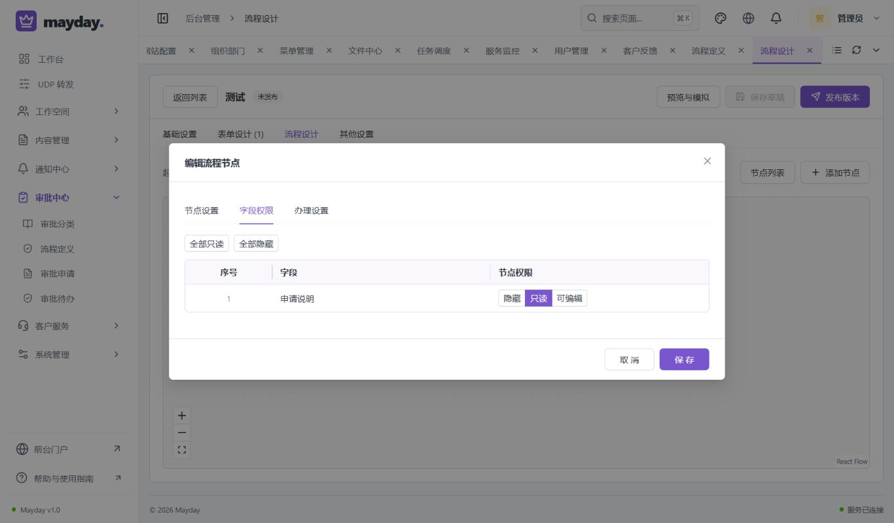
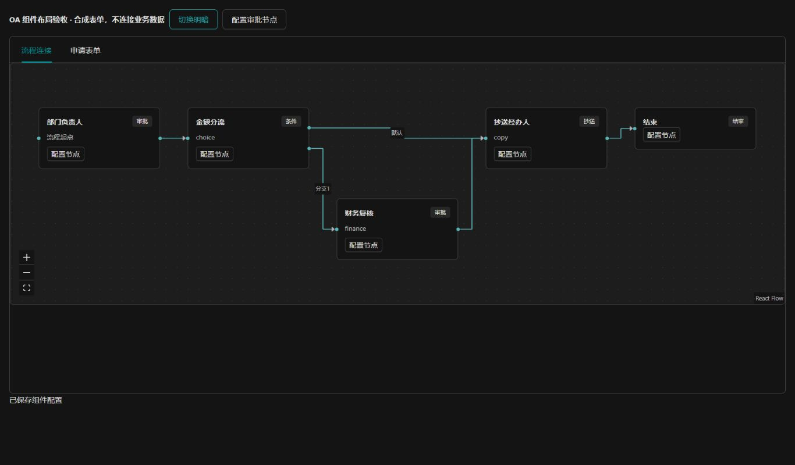
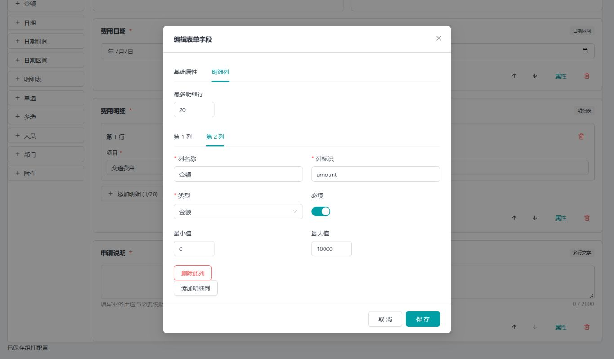
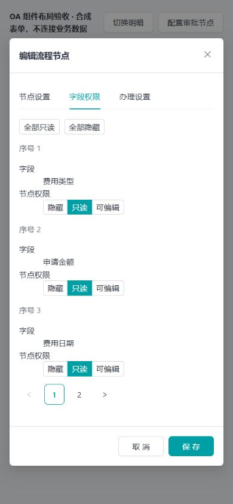

# OA 流程闭环验收记录

验收日期：2026-10-02。本轮对应“按正常 OA 产品完善设计、表单、执行和退回”的要求。原实现只有基础审批，缺少申请草稿、退回修改重提、顺签和抄送等关键环节；本轮补齐常见内部请假、报销、采购和内容审批的核心链路。高级能力和未完成的验收单独列出，不将功能实现等同于全部验收完成。

## 交付内容

- 设计器使用实际节点连接图，宽屏横向排布、条件分支独立通道，窄屏可移动和缩放；仍提供节点列表。表单采用真实运行控件预览，支持 13 类控件、半行/整行布局、日期区间、日期时间和明细表。字段属性和明细列分标签编辑，明细列逐列设置必填、长度和金额上下限。
- 节点配置分为节点设置、字段权限、办理设置和条件规则；字段权限用隐藏/只读/可编辑矩阵，并按弹窗实际容量分页。支持指定用户、角色或部门负责人，会签、或签、顺签、抄送和条件分流。
- 申请支持仅本人可见的持久草稿、继续填写、正式提交、撤回、退回申请人修改重提，以及退回本轮实际经过的前置审批节点。驳回结束与退回修改分别处理，终止必须有理由与管理权限。
- 每轮提交保留独立表单和人员快照，每次回到节点创建新办理批次；旧待办失效，旧同意结果不能推进新轮次。顺签未来人员不提前获得待办或参与者读取资格，抄送只读且阅读不改变申请版本。
- 保留转交、加签、评论、催办、超时提醒、站内通知和工作台待办。正式发布版本不可变；查看、办理、转交和业务关联均重新核对权限、数据范围和版本。
- 内容适配器在草稿创建、每次保存、草稿查看和正式提交时分别检查当前业务权限。默认业务草稿校验拒绝未实现的适配器，避免新业务接入时遗漏授权。
- 前后台旧有工程规范继续执行，新增职责、状态、事务、快照和字段权限说明；公开数据库仍仅交付 `database/mayday.sql`，内部 V1–V19 不改写。

配置、操作语义、二次开发接口及边界详见 [OA 使用与扩展](../oa-workflow.md)。

## 自动检查与真实接口

最终前端工程记录 `.local/oa-project-delivery.log`：

- 手写 Java 214 个文件、前端 113 个文件，AST 注释/导入/类型约束检查无待处理项；前后端格式检查通过。
- 32 项模型与生成器检查、48 项真实 React 组件交互检查全部通过，失败和跳过均为 0；类型检查和生产构建通过。
- 真实控制器契约共 138 个路径，与生成的 TypeScript 类型一致。流程 DTO、动作和草稿接口通过真实后端生成，不人工修改生成类型。
- Java 全模块测试共 91 项，79 项执行通过、12 项按外部环境条件跳过、0 失败、0 错误；跳过包括旧采集数据库条件测试 11 项、S3 条件测试 1 项，不计为通过。记录 `.local/oa-backend-final2.log`。本轮未改动 UDP 业务，也未重新进行持续速率验收。

最终隔离基线编号 `20261002141131006-1ab6c2`，结果为 passed：

- 升级库和纯净新建库各 **135 项真实 MySQL HTTP 检查**通过，失败、跳过均为 0。两个环境独立验证同一最终服务端实现。
- 草稿不生成待办或提前改变业务状态；其他用户和管理员不能读取他人草稿，正式提交后不能用草稿删除接口删除申请。
- 草稿可缺必填项，但已填的日期区间、明细列类型、金额上下限和未知字段仍严格校验；正式提交必须完整。
- 顺签只激活当前人员；退回申请人后修改重提产生第二轮，旧任务禁止办理。抄送字段遮蔽、历史轮次读取和已读行为通过检查。
- 退回前置节点只接受实际经过的目标，并反复创建新的审批批次；旧或签结果不沿用。撤回、修改重提、管理员终止及结束后不可复活通过检查。
- 同版本的同意与退回并发办理，只有一项成功，另一项返回 409；历史不重复、无遗留有效旧待办。
- 互斥分支允许合法重复审批人；金额 `0` 与 `0.00` 比较一致。旧发布版本、字段遮蔽、数据范围、附件、内容修订关联和审核后发布的原回归持续通过。
- 内容草稿创建后撤销申请人的业务权限，查看、保存和提交均被拒绝；拒绝事务不改变草稿版本，恢复权限后正常继续。

接口回归使用隔离数据库及专属测试账号，结束后按精确 ID 清理测试记录。没有在日常库建立演示申请、变更角色或发布用户原有草稿。

## 数据库与本机升级

- V20 增加审批轮次、节点办理批次、实际路径、抄送已读和表单快照；旧申请回填第一轮，原历史不清空。新增字段、状态和业务意义有中文 COMMENT。
- 独立升级库、纯净 Flyway 新建库、唯一 SQL 安装库一致：48 张业务表、483 个字段、122 个索引、45 个外键；列定义、中文 COMMENT、索引及外键语义均核对通过。
- 原数据完整恢复、角色权限与业务快照保持一致；模块开关组合、纯净初始化、重启不重复初始化和控制器契约检查通过。
- 本机升级编号 `20261002142833347` 为 passed：停写备份和旧镜像保留后应用 V20，原账号、角色、组织、内容及相关记录保持一致，前后端和 MySQL 已启动。
- 最终页面细节仅重建并更新前端，没有重复迁移或重导日常数据库。V20 已安装后不可修改，下一结构变更必须追加 V21。

原始结果和完整数据库备份位于忽略目录 `.local`；不提交业务备份、会话、密码或测试凭证。

## 浏览器实测及截图

本机使用已有登录会话检查新版本真实页面，不改变原有未发布流程：

- 真实设计器的连接图、13 类控件库、原表单、节点字段权限可以打开。未修改节点直接取消，无误报丢弃修改提示。
- 在 1366×800 桌面，控件库改为两列后高度 286px，页面尺寸与视口一致；不会因 13 个控件竖排而在空表单首屏制造滚动条。真实单字段权限弹窗内容宽/滚动宽均为 850px，高/滚动高均为 239px，无默认溢出。
- 额外使用真实生产 React 组件和明确标识的合成表单检查多节点分支、明细列设置、深色主题及手机布局。该页面不连接业务接口，也不伪造登录或业务申请。
- 390×844 手机权限矩阵按实际空间每页显示 3 条，弹窗内容高/滚动高均为 591px、宽/滚动宽均为 358px，无默认横纵溢出。1366×800 明细列属性逐列编辑，弹窗宽 640px、内容高 562px，无默认溢出。
- 深色连接图的工具背景、文字和图标采用当前主题 Token，已实测不再出现白色工具块。长表单超过窗口时允许正常滚动，不裁切字段冒充无滚动。

以下前两张为日常后台实际页面；后三张明确为合成数据的真实组件布局验收：

## 尚未完成及能力边界

隔离环境完整浏览器办理链路（界面中发起、办理、退回、修改重提）仍停在本次登录滑块。已单独向用户请求本次验证码处理授权，尚未收到回复；没有绕过验证码或把 API 测试凭证注入浏览器。因此本轮真实 API 链路、组件交互、设计器实屏、升级检查已通过，**完整浏览器办理验收未标记完成**。隔离预览及最新基线暂保留用于接续，不影响日常库。

当前支持常见内部 OA 的核心审批闭环，不宣称覆盖全部大型 OA 或完整 BPMN：暂不提供并行汇合网关、子流程、表单公式、自动日历计算、审批代理/离职自动交接、电子签章和外部企业消息通道。报销总金额及请假天数需要填写；人员失效或权限撤销时停止推进并报错，不静默跳过，也不自动管理员重指派。多实例消息和特定财务/人事规则需由业务模块继续接入并验收。
