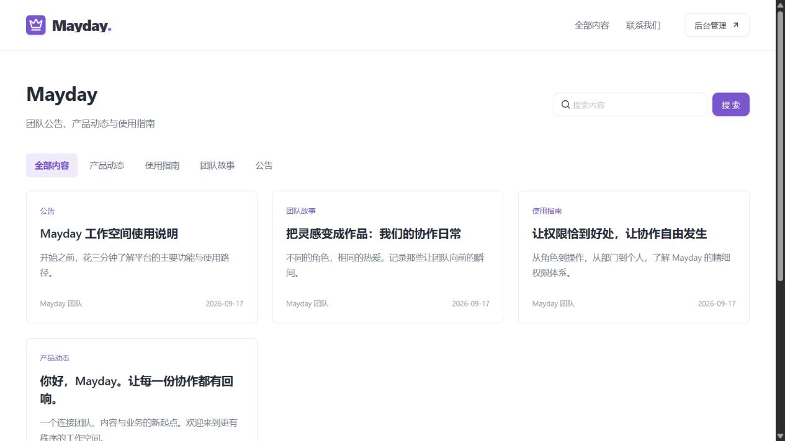
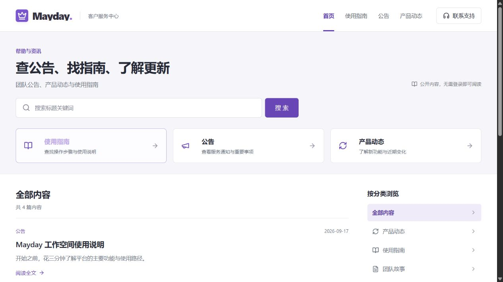

# 客户门户首页改版验收 · 2026-09-21

用户确认本次前台定位为“客户内容与服务门户（公告、指南、更新）”。本次直接改进现有 React 门户，继续使用真实 Java 公开接口。没有新增演示站或替换业务数据。

## 客户路径与审查发现

1. **进入首页，判断从哪里开始。** 原首页只有站点名、较小的搜索框和同规格文章卡片，后台管理按钮占据主导航。改为明确的服务定位、主搜索入口、指南/公告/更新分类入口；管理入口保留在页脚。分类名称和链接来自后台启用分类。
2. **查找具体内容。** 原搜索无结果只有一句提示，没有恢复动作。现在显示结果总数及当前条件，可分别移除关键词、分类、标签，或清除全部条件。无结果提供重新浏览和联系支持入口。搜索框清空立即同步查询；按现有后端能力明确标注“标题关键词”。
3. **阅读并继续浏览。** 原详情返回固定首页，客户需要重选筛选条件。现在标题及阅读全文链接保留来源查询，正文上下都有返回入口，另有同分类继续阅读。404 提供其他内容入口；移除浏览量提示里的内部实现说明。
4. **手机使用。** 原手机隐藏网站导航，留下后台按钮，长卡片让扫读困难。现在保留客户导航和完整分类，正文采用自然高度的摘要列表；手机不重复展示桌面三张快捷入口。触控输入、导航、文字换行和空态均按窄屏调整。
5. **需要进一步帮助。** 页头、空态和内容侧栏提供联系路径；邮箱、电话、地址只读取已有公开配置。联系锚点定位到页脚并移动键盘焦点；电话有拨号链接，邮箱有邮件链接。本次没有发送邮件或拨打电话。

## 实现约定

- `frontend/src/components/Portal.tsx`：共用站点外框、主题、分类图标、搜索、文章摘要和联系方式，首页与详情保持一致。
- `frontend/src/lib/portal.ts`：共用公开配置、分类缓存、SEO 和 URL 参数处理。分类用途仅控制图标/说明，不改变后台分类名称或发布权限。
- `frontend/src/pages/PortalPage.tsx`：首页查询与详情路径；筛选保存在 URL；非法分页参数不进入接口，超出总页数时恢复有效页。
- `frontend/src/portal.css`：仅作用于门户。保留后台内容预览共用的两条原样式约定。
- 站点名称、简介、分类、正文、推荐、置顶、封面和联系方式仍由既有后台管理。没有图片的内容采用纯文字排版，不填充装饰图；有封面的列表仍显示后台图片。
- 公共配置和内容保留 30 秒刷新。推荐、指南查询出错时不显示旧结果；详情下线或删除后按原公开接口隐藏。

## 实测记录

- 桌面 1280×720、1440×900，平板 768×1024，手机 390×844 与 320×740；已检查导航、搜索、列表布局，没有整页横向溢出。
- 真实搜索“权限”返回 1 篇；进入正文后“返回浏览结果”恢复 `?q=权限`、输入框和结果。
- 手机“使用指南 + 找不到的服务说明”组合查询返回 0 篇，显示两个筛选条件；清除筛选后恢复 4 篇现有公开文章。搜索提交后搜索框保持可见。
- `?category=28&page=999` 自动恢复到该分类有效页；失效详情 `/articles/2147483647` 显示下线/不存在提示，可返回浏览。
- 联系支持锚点进入可见页脚，焦点落在 `contact`；正式页面用 Tab/Enter 验证“跳到主要内容”，焦点落在 `site-main`。
- 正式部署后重新验证搜索和输入框清空；首页真实内容加载正常。最后读取浏览器警告/错误日志为空。
- TypeScript 与 Vite 生产构建通过。仅重建前端容器；前端 HTTP 200，后端健康状态 UP。旧前端镜像保留为 `mayday-frontend:before-portal-customer-20260921`，详见 [部署记录](deployment.json)。

本轮未改后端代码、数据库结构或现有文章；正常阅读会按既有规则增加浏览次数。本轮不重复整个后台业务测试矩阵。当前现有数据没有封面、推荐文章、标签和多页列表，因此这些非默认分支没有通过新增业务数据做端到端验证；未进行完整屏幕阅读器认证。

## 页面证据

同为 1280×720 的首页对比：

手机首页：

其他路径：[桌面首页](05-home-desktop.png)、[正文阅读](06-article.png)、[手机搜索空态](09-mobile-search.png)、[联系支持](10-contact-mobile.png)、[失效文章](11-article-unavailable.png)。原问题证据：[原搜索空态](02-before-search-empty.png)、[原手机首页](03-before-mobile.png)、[原正文](04-before-article.png)。
