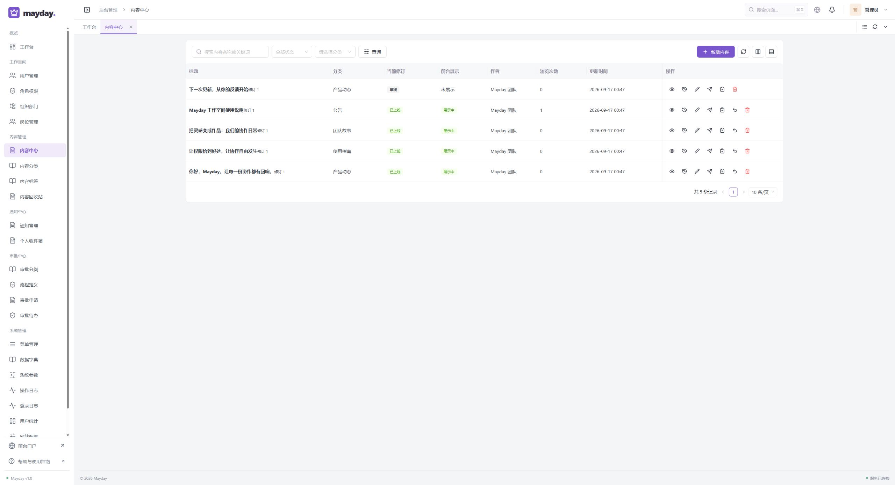
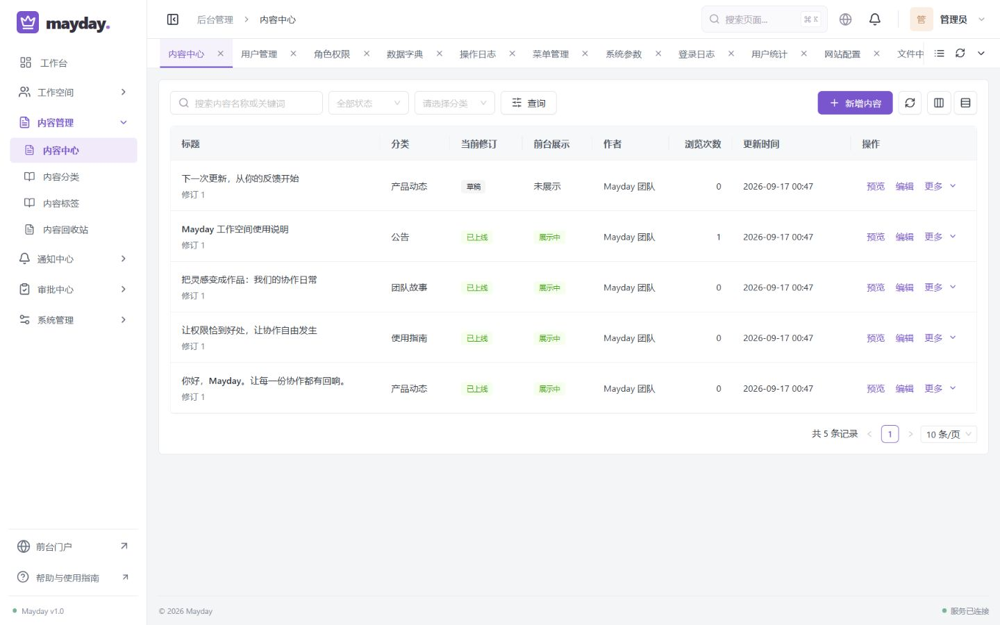

# 后台布局与交互细节修复

2026-09-19，在 P6 交付后根据用户实际截图继续检查。P6 的功能与权限通过不代表视觉细节已经充分验证；本次单独记录布局、导航和操作体验的修复。

## 发现与修复

1. **菜单无法按分组收起。** 原来每组只是标题，24 个页面默认同时展开。现在单侧导航默认只展开当前页面所属分组，点分组标题可收起；展开另一组时收起前一组。通过标签页、搜索或直链进入页面会自动定位分组。侧栏缩窄后显示分组快捷菜单，不再堆积全部页面图标。
2. **大屏内容区留白过多、表格贴边。** 原布局残留 1740px 最大宽度。现在后台随可用宽度伸展，桌面外侧留白统一 16px，列表卡片内边距 16px，表格单元格另有独立留白；筛选、操作、表格和分页对齐。手机两层留白分别为 12px。
3. **内容信息与操作过密。** 标题、修订信息分行；标题可以直接预览，过长内容省略并保留完整标题提示。内容、通知与流程复用文字行操作组件，保留常用动作，其余进入“更多”，发布、撤回、下线和删除仍维持授权与原确认流程。1440px 桌面内容列表可完整显示所有列，无需横向滚动。
4. **附加筛选未随重置清除。** 用户部门、内容状态/分类、通知状态、日志日期、参数分组现与关键词和通用状态统一重置。
5. **标签页与小屏细节。** 标签自动定位仅滚动横轴，不牵动页面纵向位置；窗口和侧栏宽度变化时保持当前标签可见。手机取消表格固定操作列，避免遮住内容。窄屏导航可以用 Escape 关闭，焦点返回触发按钮，开启时背景不可交互且焦点留在导航内。补充菜单状态、搜索框及品牌快捷入口的可访问名称，并遵循减少动画偏好。

## 浏览器实际检查

- 同一内置浏览器对比用户截图对应的 2560×1389 宽屏。修正后内容区两侧各 16px、表格距卡片边约 16.8px（含边框），菜单不溢出，整页没有横向溢出。
- 1440×900 检查所有 24 个后台页面的导航、加载和页面宽度；无加载错误、无整页横向溢出。工作台文档高度为 900px，默认菜单不滚动。
- 390×844 检查导航、内容与日志列表、复杂筛选栏及多标签页；当前标签可见，固定操作列已取消，表格只在自己的容器内横向滚动。
- 780×900 内容长弹窗和 1440×900 角色权限长弹窗：固定标题、关闭与底部按钮可见，正文独立滚动。空内容提交被必填规则拦截并聚焦第一个错误字段，没有创建测试文章。
- 内容“更多”打开原发布弹窗，取消后不写入；状态筛选后点击重置恢复全部数据。分组标题通过 Enter 展开，紧凑导航可以进入数据字典；手机 Shift+Tab 保持导航内焦点、Escape 返回打开按钮。
- 最终部署后复测手机导航中的使用指南：打开帮助时导航自动收起，焦点进入弹窗；Escape 关闭弹窗，桌面尺寸恢复正常。
- 最后读取浏览器警告/错误日志为空。页面检查为现有数据读取和未提交表单，未创建通知、角色、流程或文章；正常登录产生审计记录。

逐页与尺寸检查见 [checks.json](checks.json)。本轮没有重新验证整个后端业务矩阵，也不宣称完整无障碍认证；后端 API、数据库迁移与数据卷未修改。

## 截图证据

修复前：

修复后的常见桌面尺寸：

其他检查：[宽屏](02-content-after-2560.png)、[用户管理](03-users-1440.png)、[角色长表单](04-role-modal.png)、[紧凑导航](05-compact-navigation.png)、[手机表格](06-mobile-table.png)、[手机导航](07-mobile-navigation.png)、[手机日志](08-mobile-logs.png)、[收件箱空态](09-inbox-empty.png)、[工作台](10-dashboard-1440.png)、[窄屏内容弹窗](11-content-modal-780.png)。

## 构建与部署

TypeScript 检查及 7 项现有工作区测试通过。前端 Docker 生产构建通过后，仅更新前端容器；旧镜像保留为 `mayday-frontend:before-ui-polish-20260919`，构建记录位于 `.local/ui-polish/build.log`。最终发布状态见本目录 `deployment.json`。
